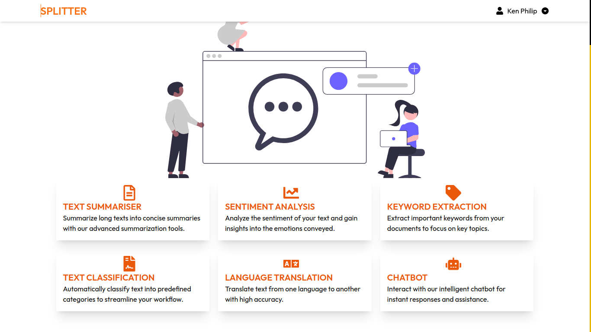

## `PROMPT SHARE` ##

## Table of Contents
- [Overview](#overview)
- [Features](#features)
- [Technologies Used](#technologies-used)
- [Installation](#installation)
- [Usage](#usage)
- [API Endpoints](#api-endpoints)
- [Contributing](#contributing)

## Overview
PromptShare is a cutting-edge chat system powered by Gemini, designed to facilitate seamless interactions and advanced text processing. Whether it's summarizing text, performing sentiment analysis, extracting keywords, or engaging in real-time conversations with a chatbot, PromptShare has it all!

## Screenshot



## Features
- **Text Summarization**: Automatically condense lengthy texts into concise summaries.
- **Sentiment Analysis**: Gain insights into the emotional tone of your text.
- **Keyword Extraction**: Identify and extract significant keywords from documents.
- **Text Classification**: Classify text into predefined categories effortlessly.
- **Language Translation**: Translate text accurately between different languages.
- **Interactive Chatbot**: Engage with an intelligent chatbot for instant responses and assistance.

## Technologies Used
- **Node.js**: Server-side JavaScript runtime for building scalable applications.
- **Express.js**: Fast web framework for Node.js to handle HTTP requests and routing.
- **MongoDB**: NoSQL database for storing chat messages and user data.
- **Gemini API**: Advanced AI capabilities for text processing and interactions.
- **React**: Frontend library for building user interfaces.
- **Tailwind CSS**: Utility-first CSS framework for styling the application.

## Installation

1. **Clone the Repository**
   ```bash
   git clone https://github.com/Ritahchanger/Promptshare.git
   cd Promptshare
